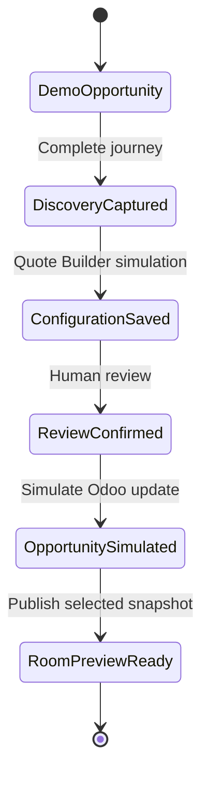

# PFM Commercial Experience — Retail go-demo package

**Status:** implementation-ready product specification  
**Decision purpose:** internal go/no-go for further development  
**Demo duration:** 4–6 minutes  
**Scope:** clickable, high-fidelity Retail demo; no production integrations  
**Date:** 4 August 2026

---

## 0. Executive recommendation

Proceed with a focused Retail go-demo, but do not continue either existing HTML prototype unchanged.

Use `v2-location-intelligence.html` as the visual and interaction reference for the persistent location canvas, zoom behaviour and data lenses. Replace its current five-stage spatial navigation with the six-stage commercial journey and add the missing proof, configuration and action scenes. Retain `v1-commercial-experience.html` only as a source for pain-first entry ideas and the adjustable capture-rate interaction; do not carry forward its dashboard-like home screen, generic card navigation or isolated one-pager structure.

The go-demo should tell one story:

> A multi-location retailer wants to understand why apparent location potential does not consistently become store visits and commercial performance. PFM separates surrounding context, exact physical measurement and connected business data, then helps the customer define what to examine, configure and do next.

The demo is not a catalogue of everything PFM can do. It is a guided commercial product that turns one customer question into an evidence-aware next step and a controlled follow-up flow.

### Go-demo promise

**See the whole location. Know what is measured. Decide what to examine next.**

### Demo truth statement

All companies, people, locations, metrics, visualisations, results and system actions used in the go-demo are fictional or explicitly labelled as illustrative. The demo does not imply live Odoo, SharePoint, Microsoft Entra, geo/mobile-provider or Digital Quote Builder integrations.

---

## 1. Sharpened product definition

### Product definition

PFM Commercial Experience is one guided commercial experience for exploring a physical-location question, building confidence in the relevant evidence, configuring a solution direction and preserving the agreed next step.

It combines three controlled modes on one reusable content and component base:

- a sales conversation workspace;
- a public, customer-facing lead experience;
- a secure, selected client follow-up view.

The location remains the primary narrative surface. The experience moves from the world around a location to what happens at its threshold and inside it, before connecting business context and progressing to a decision. Technology appears only when it helps explain how a question can be answered.

### Product job

The product must help a user answer five questions:

1. What business or location question are we examining?
2. Which evidence layers can inform it?
3. What is directly measured, externally contextual, customer-supplied or derived?
4. What evidence makes the proposed direction credible?
5. What is the next commercially useful action?

### Product boundaries

The product is:

- a visual discovery and commercial continuity layer;
- a reusable presentation system across three modes;
- an orchestrator of context passed to the existing Quote Builder;
- an entry point to Odoo 18 commercial follow-up;
- a controlled publisher of client-room snapshots.

The product is not:

- a replacement for Odoo 18;
- a replacement for SharePoint as source and approval environment;
- a new pricing engine;
- a generic document library;
- a dashboard pretending to contain live customer data;
- a claim that combining data automatically creates a business outcome.

### Primary success outcome

Leadership can see that a single product can improve commercial consistency and continuity from first interest to discovery, configuration and follow-up—without requiring production integrations to believe the concept.

---

## 2. Target audiences and product modes

### Audience hierarchy

| Audience | Primary need | Demo evidence of value |
|---|---|---|
| PFM salesperson or account manager | Lead a confident, relevant conversation and retain useful discovery | Existing opportunity context, guided story, saved selections, Quote Builder handoff and next activity |
| Public prospect or website visitor | Understand what PFM can reveal without knowing products or sensor terminology | Pain-first entry, self-guided location journey and a proportionate contact conversion |
| Customer stakeholder | Revisit only the agreed story, proof, direction and next step | Selected, read-only client-room snapshot with provenance and expiry treatment |
| PFM content owner | Reuse approved material without duplicating slides | Shared proof modules and publishing states represented in fixtures; not a demo-facing CMS |
| Leadership reviewer | Decide whether the product direction deserves investment | A coherent 4–6 minute flow and honest simulation boundaries |

### Mode definitions

| Mode | Entry | Behaviour | Completion | Authentication in go-demo |
|---|---|---|---|---|
| **Sales Mode** | Select a fictional existing Odoo opportunity or create a fictional prospect | Presenter-led; guided route with optional lens controls and saved story items | Review handoff, simulate Odoo update, create client-room preview and next activity | Simulated signed-in PFM user |
| **Public Experience** | Choose Retail and one business question; no company wall at entry | Shorter self-guided route; no internal opportunity data, sales controls or draft states | Submit minimal company/contact details and consent; simulate match/create and opportunity creation | Anonymous until conversion |
| **Client Room** | Open from a generated preview link after the sales flow | Read-only, selected snapshot; no free browsing of the content library | Confirm next step or request contact; activity is represented as summarised to Odoo | Simulated secure, time-bound access |

### Shared versus mode-specific components

Shared components:

- location canvas;
- six-stage journey rail;
- data-layer legend and truth labels;
- approved proof modules;
- capability selection;
- demo disclaimers;
- accessible copy and interaction patterns.

Mode-specific components:

- Sales: customer/opportunity context, save-to-story, internal finish review;
- Public: challenge-first entry, progressive contact capture, public-safe proof;
- Client Room: fixed snapshot, access/expiry state, agreed next step;
- content-owner workflows are outside the go-demo.

---

## 3. Canonical Retail demo scenario

### Fictional fixture

Use a clearly fictional company throughout:

- **Company:** Northstar Retail Group
- **Contact:** Alex Morgan
- **Opportunity:** Store opportunity and conversion review
- **Market:** Netherlands
- **Portfolio:** 24 locations
- **Demo location:** Utrecht Central Store
- **Business question:** Where does location potential fail to become visits and commercial performance?

No real customer logo, recognisable store design, real address or purported result is used.

### Selected story

- Context: understand surrounding reach and passing movement;
- Measure: establish directly measured visits at the threshold;
- Understand: connect anonymised visit patterns with selected POS and staffing context;
- Prove: explain method, privacy, data provenance and a fictional illustrative case pattern;
- Configure: select entrance intelligence, capture-rate analysis and portfolio comparison;
- Act: pass structured context to the existing Quote Builder, simulate Odoo update and publish a selected client-room snapshot.

### Presenter timing

| Segment | Target time | Cumulative |
|---|---:|---:|
| Entry and customer question | 0:35 | 0:35 |
| Context | 0:40 | 1:15 |
| Measure | 0:40 | 1:55 |
| Understand | 0:50 | 2:45 |
| Prove | 0:50 | 3:35 |
| Configure | 0:55 | 4:30 |
| Act and Client Room | 0:55 | 5:25 |

Target normal run: **5 minutes 25 seconds**. A compressed run must remain possible in four minutes by skipping optional detail drawers; a six-minute run may open the method explainer and Public Mode comparison.

---

## 4. Screen-by-screen storyboard

### Screen 0 — Mode gateway

**Purpose:** establish that this is one product with three controlled uses.

**Dominant visual:** three mode labels connected to one simplified location canvas; no card wall.

**Copy:**

- Headline: `One location story. Three ways to use it.`
- Support: `Lead the conversation, invite public exploration or share a selected customer view.`

**Actions:**

- `Start Sales Mode` — primary demo path;
- `Preview Public Experience` — secondary;
- `Open sample Client Room` — tertiary, labelled as a preview.

**State:** `demo_environment` is persistently visible but quiet.

**Presenter beat:** “The same approved content and interaction system supports sales, lead generation and customer follow-up.”

### Screen 1 — Sales Mode: opportunity context

**Journey role:** pre-journey setup.

**Dominant visual:** a single search field with one fictional result and a compact opportunity summary.

**Content:** Northstar Retail Group, opportunity title, country, 24 locations, fictional contact.

**Actions:**

- `Continue with opportunity`;
- `Create new prospect` opens a simulated match/create form;
- discreet `Switch to Public Experience`.

**Required labels:** `Simulated Odoo 18 data` and `No records will be changed`.

**Avoid:** real customer names, live-system language such as “loaded from Odoo”, and Microsoft/AWS integration claims in the footer.

### Screen 2 — Discovery question

**Journey role:** sets the thread that binds all six stages.

**Dominant visual:** stylised store within its surroundings, with one highlighted question.

**Prompt:** `What do you want to understand?`

**Primary selection:** `Why does location potential not consistently become visits and performance?`

**Two optional alternatives, visible but not used in the canonical run:**

- `Which locations need attention first?`
- `How do visit patterns differ across the day?`

**Action:** `Explore this question`.

**Captured state:** challenge ID, vertical, location count and presenter-selected route.

### Screen 3 — Context

**Customer question:** `Who is this location reaching?`

**Dominant visual:** the location inside a translucent, dashed catchment field with approach paths.

**Visible layer:** Mobile & geo only by default. Physical location marker remains visible as orientation, not as a metric.

**Truth label:** `External context · illustrative sampled/modelled data`.

**Content:** origin, frequency and passing-movement concepts. Any figures must carry `Illustrative demo data`; do not use “exact”, “true” or unqualified precision.

**Interaction:** toggle between `Catchment`, `Approach` and `Cross-visitation` concepts without changing the core location.

**Story action:** `Add context question` saves a question, not a result claim.

**Transition:** camera moves toward the entrance; `Measure what becomes a visit`.

### Screen 4 — Measure

**Customer question:** `What actually becomes a visit?`

**Dominant visual:** entrance threshold and count line aligned with the physical entry.

**Visible layer:** Physical measurement. Mobile/geo remains a subdued, clearly separate contextual field outside the threshold.

**Truth labels:**

- `Direct measurement · illustrative sensor data`;
- `External context · illustrative estimate` for any passer context.

**Interaction:** animate anonymous crossings and change the measured visit count. A small formula drawer may show `capture = measured visits ÷ aligned passing audience`, with a warning that capture is valid only when definitions, area and time window align.

**Copy:** `Separate surrounding opportunity from measured visits.`

**Story action:** `Add entrance measurement`.

**Transition:** `Understand the visit`.

### Screen 5 — Understand

**Customer question:** `What happens after entry?`

**Dominant visual:** simplified in-store route and zones, with a restrained POS/staffing connector.

**Visible layers:**

- solid purple anonymous physical route;
- neutral business-data panel connected by a restrained red line;
- derived insight off by default.

**Truth labels:**

- `Direct measurement · illustrative route and dwell data`;
- `Customer-supplied · illustrative POS and staffing data`.

**Interaction:** turn on `Derived insight` to reveal a translucent purple-to-red comparison band and one prompt: `Examine periods where visits rise but conversion does not.`

**Important:** this is a decision prompt, not a diagnosed cause. Do not infer staff shortage, missed revenue or uplift.

**Story action:** `Add performance question`.

**Transition:** `Check why this is credible`.

### Screen 6 — Prove

**Customer question:** `Why can we trust the direction?`

**Dominant visual:** one proof theatre with three selectable proof tabs, never three equal cards.

**Default tab — Method:**

- 20–30 second muted video or storyboard placeholder showing outside context, entrance measurement and anonymous in-store measurement;
- captions always available;
- label whether footage is final, approved or placeholder.

**Tab — Evidence:**

- one fictional/illustrative case pattern: `Question → Evidence used → Decision enabled`;
- no result, uplift, ROI, accuracy or customer attribution;
- status label: `Illustrative structure — approved case required`.

**Tab — Why PFM:**

- concise factual capability story: physical-location measurement, data processing/service context, connection of relevant business data, and commercial interpretation;
- privacy/method link;
- no unverified superlatives or certifications.

**Logo treatment:** no customer-logo strip in the initial canonical build. Show an `Approved customer proof` placeholder only in a development annotation, not as customer-facing UI. Add logos later only with a permission record and approved use context.

**Story action:** `Add proof module`.

**Transition:** `Configure the direction`.

### Screen 7 — Configure

**Customer question:** `What should we examine first?`

**Dominant visual:** three selected capabilities mapped back onto the same location—not a pricing table.

**Prefilled configuration:**

- vertical: Retail;
- country: NL;
- locations: 24;
- challenge: location potential to visits and performance;
- data layers: mobile/geo context, physical measurement, business data;
- capabilities: entrance intelligence, capture-rate analysis, portfolio comparison.

**Interaction:** presenter can deselect a capability and see its location overlay disappear. `Review in Quote Builder` opens an in-product handoff preview.

**Handoff preview:** show the provisional `demo-v1` payload in human-readable form, with a compact `Technical payload` expander.

**Boundary copy:** `Pricing and product logic remain in the Digital Quote Builder.`

**Return state:** `Configuration saved · review required · no quotation created`.

**Transition:** `Agree the next step`.

### Screen 8 — Act

**Customer question:** `What happens next?`

**Dominant visual:** a review surface with exactly four simulated intents:

1. update the fictional Odoo opportunity;
2. attach structured discovery and the saved configuration reference;
3. create the next activity `Location and data workshop`;
4. publish a selected client-room snapshot.

**Controls:**

- checkboxes are preselected but editable;
- primary: `Simulate update and create room`;
- secondary: `Save demo session only`.

**Required labels:** `Simulation`, `No external systems are called`, and `Human review required`.

**Completion receipt:** show individual statuses instead of one success toast:

- Opportunity: `simulated_update`;
- Configuration: `saved_for_review`;
- Quotation: `not_created`;
- Activity: `simulated_create`;
- Client Room: `preview_ready`.

### Screen 9 — Client Room preview

**Purpose:** prove controlled continuity, not provide another exploration interface.

**Dominant visual:** a single selected-location story with a fixed narrative spine.

**Visible content:**

- customer question;
- selected Context, Measure and Understand scenes;
- selected proof module and its status;
- configuration summary;
- agreed next step and owner;
- generated/expiry labels;
- privacy/method note.

**Hidden content:** internal notes, Odoo identifiers, draft/unapproved proof, alternative cases, unrestricted library, pricing unless explicitly approved for the snapshot.

**Primary action:** `Confirm workshop` or non-sending preview equivalent in the go-demo.

**Secondary action:** `Request a change`.

**Required label:** `Client Room preview · access controls simulated`.

### Screen 10 — Public Experience comparison

**Purpose:** demonstrate mode reuse in 20–30 seconds after the canonical Sales run.

**Entry:** `Retail → Understand capture` without asking for a company.

**Journey:** same Context, Measure and Understand components; condensed Prove; no customer-specific saved story or internal controls.

**Conversion:** after meaningful exploration, request company, name, business email, country and the preferred next step. Explain what will happen before submission.

**Simulated completion:** `We would check for an existing company/contact and create or update a CRM opportunity for human follow-up.`

**Rule:** Public Experience is a customer-facing lead generator, not an internal questionnaire or a public clone of Sales Mode.

---

## 5. Journey specification

| Stage | Customer question | Primary evidence | User action | Captured state | Exit condition |
|---|---|---|---|---|---|
| Context | Who is this location reaching? | Mobile/geo context | Select relevant outside context | context question and layer | User understands context is not exact entrance measurement |
| Measure | What actually becomes a visit? | Physical sensing | Inspect threshold and definitions | measurement capability | Direct and contextual data are visibly distinct |
| Understand | What happens after entry and in performance context? | Physical + business data + optional derived insight | Add business context; reveal a decision prompt | selected data connections and question | No cause or outcome is overstated |
| Prove | Why trust this direction? | Method, privacy, approved evidence | Select proof module | proof ID and approval status | Proof status and limits are clear |
| Configure | What should we examine first? | Selected capabilities | Review prepared context in Quote Builder | configuration reference | Pricing logic remains outside the Experience |
| Act | What happens next? | Reviewed commercial intent | Simulate Odoo update and room publication | statuses, activity, snapshot reference | User sees controlled human-reviewed continuity |

### Navigation rule

The six stages are the primary navigation. Spatial zoom is the transition language inside stages, not a competing five-step navigation model. A presenter may go back, but the primary CTA always advances one stage. Optional drawers must never be required to complete the story.

---

## 6. Data and truth semantics

### Canonical data taxonomy

| Layer | Definition | Visual treatment | Required label | Permitted language | Prohibited implication |
|---|---|---|---|---|---|
| Mobile & geo | Sampled, modelled or provider-derived context around a location | Translucent field, dashed edge, soft motion | `External context` plus method/sample qualifier | reach, origin, frequency, cross-visitation, surrounding movement | exact footfall at the entrance; replacement for physical sensing |
| Physical measurement | Signal measured at a defined physical location or threshold | Solid purple line, path, point or zone | `Direct measurement` plus device/time/area definition when relevant | visits, crossings, dwell, route or zone observation within defined scope | automatic knowledge of identity, intent or revenue outcome |
| Business data | Customer-connected operational or commercial data | Black/grey structure with restrained red connector | `Customer-supplied` or named source role | transactions, revenue, staffing, events, appointments, hours | PFM measurement itself generated or guarantees the business result |
| Derived insight | Calculated, classified, compared or modelled output from aligned inputs | Translucent purple-to-red glass above its source layers | `Derived insight` with formula/method access | capture, conversion, comparison, anomaly or opportunity period when definitions align | proven cause, guaranteed action or outcome |
| Decision | Human-owned question, test or next action | Black action surface with restrained red emphasis | `Decision prompt` or `Agreed next step` | examine, compare, validate, test, schedule | autonomous decision or guaranteed value |

### Truth-label component

Every quantitative or interpretive object must expose four fields:

```text
kind: external_context | direct_measurement | customer_supplied | derived | decision
status: illustrative | approved | live
source_role: human-readable source or method role
scope: time window, area or definition where material
```

For the go-demo, `live` is not permitted. `approved` may be used only for supplied and verified material. All fixture metrics default to `illustrative`.

### Layer behaviour

- A layer toggle controls visual evidence, not the truth-label legend.
- Derived insight cannot be enabled when its required source layers are off; explain the dependency.
- Turning a source layer off removes or disables dependent derived objects.
- A combined visual never erases its sources. Users must be able to inspect which inputs create a derived view.
- Heat colours are used only for meaningful intensity, not decoration.
- Purple-to-red gradients are reserved for combined/derived layers, not mobile/geo alone.

### Correction to the current v2 semantics

The current v2 uses a purple-to-red swatch for Mobile & geo, while the design system reserves transparent purple-to-red layering for derived insight. The go-demo must use a translucent purple field with dashed boundaries for mobile/geo; reserve the gradient for derived output.

---

## 7. Video, cases, logos and Why PFM

### Recommended proof architecture

Place all proof in the **Prove** stage and reuse selected proof in the Client Room. Do not scatter logos, cases and promotional claims across the journey.

| Asset | Job | Go-demo treatment | Publication gate |
|---|---|---|---|
| Short video | Explain physical method and the difference between context and measurement quickly | 20–30 second muted placeholder with captions and visible placeholder status | content owner, technical review, privacy review and usage rights |
| Case | Show how evidence supports a decision | One illustrative, unattributed structure without results | named customer permission, claim verification, approved wording and market/use scope before attribution |
| Customer logos | Provide relevant social proof | Excluded from canonical v1 demo UI | logo permission, current artwork, approved context, geography, channel and expiry |
| Why PFM | Explain PFM's role in the data-to-decision chain | Four concise factual proof points, no superlatives | product/technical validation and brand approval |

### Why PFM copy framework

Use this structure pending formal approval:

1. `Measure physical visits where they happen.`
2. `Keep contextual, measured and connected data visibly distinct.`
3. `Connect relevant business context to the location question.`
4. `Turn evidence into a clear next test, configuration or action.`

This is capability framing, not a customer outcome claim.

---

## 8. Digital Quote Builder transition

### Product decision

The Experience owns discovery context, visual explanation and capability selection. The existing Digital Quote Builder owns solution configuration, commercial rules, pricing and quotation preparation. The go-demo must make the transition feel continuous without duplicating Quote Builder logic.

### Handoff sequence

1. Experience validates that vertical, country, location count, challenge, data layers and capabilities are present.
2. Experience displays a human-readable review.
3. Presenter selects `Review in Quote Builder`.
4. A simulated adapter accepts the versioned payload.
5. Quote Builder returns a configuration reference with `review_required: true`.
6. Experience resumes at Act with the configuration status; it does not claim that a quotation exists.

### Demo payload

```json
{
  "schema_version": "demo-v1",
  "session_id": "session_northstar_001",
  "company_id": "company_demo_001",
  "opportunity_id": "opportunity_demo_001",
  "vertical": "retail",
  "country": "NL",
  "currency": "EUR",
  "location_count": 24,
  "selected_challenges": [
    "understand-capture",
    "compare-location-performance"
  ],
  "selected_layers": [
    "mobile-geo",
    "physical-measurement",
    "business-data"
  ],
  "selected_capabilities": [
    "entrance-intelligence",
    "capture-rate",
    "portfolio-comparison"
  ],
  "source": "pfm-commercial-experience"
}
```

### Simulated result

```json
{
  "schema_version": "demo-v1",
  "configuration_id": "cfg_demo_001",
  "quotation_draft_id": null,
  "status": "saved",
  "review_required": true
}
```

### Contract gaps before production mapping

- confirmed Quote Builder input and output schemas;
- stable IDs for challenges, layers and capabilities;
- operating unit and salesperson ownership fields;
- country/entity/pricelist mapping;
- error, cancellation and stale-session behaviour;
- authentication and authorisation between adapters;
- idempotency key and correlation/request ID;
- configuration version and pricing-rule version;
- Odoo quotation-template and article mapping;
- human-review state transitions.

---

## 9. Simulated Odoo 18 and Client Room flow

### Demo state model



### Sales Mode flow

1. Select a fictional company/opportunity fixture.
2. Store discovery state locally in a typed demo session.
3. Save selected story modules with IDs and approval states.
4. Receive the simulated configuration reference.
5. Review the Odoo completion intent.
6. Simulate company/contact match or create—never both silently.
7. Simulate create/update of the opportunity.
8. Simulate creation of the next activity.
9. Generate an immutable Client Room snapshot from selected, eligible modules.
10. Show per-action results and retain an audit-event fixture.

### Public Experience flow

1. Anonymous visitor selects Retail and a challenge.
2. Session stores no customer identity at entry.
3. Visitor explores public-safe modules.
4. On explicit conversion, collect minimum contact/company data and consent.
5. Simulate duplicate match outcomes: `match_found`, `no_match` or `review_required`.
6. Simulate contact/company create or update intent.
7. Simulate opportunity creation with source `PFM Commercial Experience`.
8. Assign human follow-up in concept; do not claim automated routing rules until mapped.

### Client Room snapshot rules

- Snapshot stores references and rendered configuration at publication time; later source changes do not silently alter it.
- Only approved/publication-eligible modules may be selected.
- Internal notes and system identifiers are excluded.
- Snapshot has created date, publisher, expiry state, language and audience.
- Revocation and replacement are future production requirements; the demo represents them visually only.
- Client activity may be represented as `would be summarised to Odoo`; do not state that tracking is live.

### Adapter interfaces for the demo

```ts
interface OdooDemoAdapter {
  searchCommercialContext(query: string): Promise<CommercialContextFixture[]>;
  previewCompletion(intent: OdooCompletionIntent): Promise<CompletionPreview>;
  simulateCompletion(intent: OdooCompletionIntent): Promise<CompletionReceipt>;
}

interface QuoteBuilderDemoAdapter {
  previewHandoff(input: QuoteBuilderInputV1): Promise<HandoffPreview>;
  simulateSave(input: QuoteBuilderInputV1): Promise<QuoteBuilderResultV1>;
}

interface ClientRoomDemoAdapter {
  previewSnapshot(input: ClientRoomSnapshotInput): Promise<ClientRoomSnapshot>;
}
```

These interfaces are replaceable boundaries, not claims about current production APIs.

---

## 10. Internal go/no-go acceptance criteria

### Hard go criteria

A reviewer must mark every item pass. Any fail is a no-go for leadership presentation until corrected.

#### Story and comprehension

- [ ] Five first-time internal reviewers can state within 30 seconds that the product connects exploration, evidence, configuration and follow-up around a physical location.
- [ ] At least four of five can correctly distinguish Sales Mode, Public Experience and Client Room after the demo without prompting.
- [ ] The canonical Sales Mode run completes in 4:00–6:00 minutes without using browser back, reloading or explaining broken states.
- [ ] One customer question visibly persists from discovery through Act.
- [ ] Every screen has one dominant visual and no more than five meaningful visible groups.

#### Truth and commercial integrity

- [ ] Every demo metric and visualisation is labelled illustrative at component or scene level.
- [ ] No real customer company, contact, opportunity, address, store design, logo or case result appears unless written approval and use scope are recorded.
- [ ] Mobile/geo context cannot reasonably be mistaken for exact physical entrance measurement.
- [ ] Business data is identified as customer-supplied/connected, not generated by PFM sensing.
- [ ] Derived insight reveals its input layers and is disabled or explained when required inputs are absent.
- [ ] No copy asserts accuracy, ROI, uplift, payback, causality, certification, uniqueness or guaranteed outcome without approved evidence.
- [ ] Capture and conversion appear only with aligned definitions and accessible formula/method notes.

#### Journey and modes

- [ ] The primary navigation visibly uses all six stages in the correct order: Context, Measure, Understand, Prove, Configure, Act.
- [ ] Sales and Public share core components but have materially different entry, controls and completion.
- [ ] Public Experience does not request company details before meaningful exploration.
- [ ] Client Room is read-only, selected and visibly time-bound; it is not an unrestricted content library.
- [ ] Internal/Odoo data and draft proof cannot appear in Client Room fixtures.

#### Integration honesty

- [ ] Every Odoo, Quote Builder, Client Room and identity action is labelled simulated before it is triggered.
- [ ] The demo performs no external network calls and contains no credentials or real customer data.
- [ ] Quote Builder handoff uses a versioned payload and returns `review_required: true`.
- [ ] `quotation_draft_id` remains `null` unless a separate simulated quotation step is explicitly demonstrated.
- [ ] Completion shows per-action statuses; a single generic success toast is insufficient.
- [ ] Browser code has no Odoo, SharePoint or infrastructure secrets or direct production-adapter calls.

#### Quality and accessibility

- [ ] Layout is strong at 1440 × 900 and usable at a defined tablet viewport of 1024 × 768.
- [ ] Keyboard users can complete the canonical flow with visible focus and logical order.
- [ ] Layer meaning is not communicated by colour alone; each has a text label and shape/treatment distinction.
- [ ] Video has captions and a non-video fallback.
- [ ] Motion respects `prefers-reduced-motion` and carries explanatory purpose.
- [ ] Production build, lint and type-check pass.
- [ ] One automated smoke test covers the canonical Sales flow; a documented manual script covers presentation timing and truth labels.
- [ ] No console errors occur during the canonical flow.

### Go/no-go review scorecard

In addition to all hard criteria passing, reviewers score 1–5 on:

- three-second visual comprehension;
- navigation confidence;
- commercial persuasiveness;
- truth/evidence confidence;
- PFM brand consistency.

**Go threshold:** average ≥4.0 and no individual dimension below 3.5. The score does not override a failed hard criterion.

---

## 11. Missing content, assets and decisions

### Blockers — required before leadership go/no-go demo

| Item | Needed decision/output | Owner recommendation |
|---|---|---|
| Fictional demo fixture approval | Confirm Northstar Retail Group, 24 locations, Utrecht Central Store and all sample values as fictional/illustrative | Product lead |
| Canonical customer question | Approve the location-potential-to-visits-and-performance story as the single Retail route | Commercial/product leadership |
| Capture definition | Define numerator, denominator, aligned area and time window used in the demo | PFM data/technical owner |
| Physical measurement wording | Approve what may factually be called direct, exact, anonymous, route, dwell and zone measurement | Technical/product owner |
| Mobile/geo wording | Confirm the available method categories and mandatory limitations without naming a provider unless approved | Geo/mobile subject owner |
| Why PFM proof copy | Validate the four factual capability statements | Product + marketing |
| Video placeholder | Supply or approve a 20–30 second storyboard/placeholder and its visible status label | Marketing + technical owner |
| Illustrative case module | Approve a non-attributed case structure without performance results | Sales + marketing |
| Presentation script | Approve one 4–6 minute narration and named presenter path | Product lead |
| Prototype technical baseline | Confirm target framework/repository, local run command and test stack | Engineering owner |

### Important — required before external pilot or realistic stakeholder sharing

| Item | Needed decision/output |
|---|---|
| Approved customer case | Permission, exact claims, evidence, geography/channel scope and expiry |
| Customer logos | Current artwork plus written use permission and context per logo |
| Final method/privacy copy | Reviewed explanation for physical sensing and mobile/geo context |
| Quote Builder schema | Confirmed stable IDs, field mapping, errors and return states |
| Odoo 18 mapping | Company/contact duplicate logic, opportunity fields, ownership, operating unit, activities and quotation references |
| Client Room policy | Publisher roles, eligible content, expiry, revocation, access and activity summary |
| Public lead policy | Minimum fields, consent wording, privacy notice, routing and duplicate handling |
| Content approval model | Draft/review/approved/retired states and publication eligibility |
| Final video | Rights-cleared, captioned and technically approved asset |
| Languages | Confirm English-first demo and translation ownership/versioning |

### Later — not required for go-demo approval

- live Odoo 18 adapter;
- Microsoft Entra employee and external identity;
- SharePoint approval/publishing integration;
- production AWS CMS and application database;
- real geo/mobile provider integration;
- production analytics, consent and retention controls;
- client-room revocation and notification workflows;
- all non-Retail verticals;
- personalised market-scanning or agent-driven follow-up;
- full pricing and quotation completion inside the experience;
- external customer self-service configuration.

---

## 12. Source conflicts, gaps and duplications

### Conflicts to resolve in implementation

1. **Six commercial stages versus five v2 spatial stages.** The source documents consistently require `Context → Measure → Understand → Prove → Configure → Act`; v2 uses Market, Surroundings, Entrance, Inside and Decision. Resolution: six stages are canonical; spatial scenes live inside them.
2. **Purple-to-red semantic use.** The project instructions/design system reserve combined transparent purple-to-red layers for derived insight; v2 assigns that gradient to Mobile & geo. Resolution: mobile/geo becomes translucent purple with dashed treatment; gradient is derived only.
3. **Exactness language in illustrative fixtures.** V2 includes “681 exact visits” and “exact sensor measurement” inside a simulated scene. Resolution: label the data `Illustrative direct measurement`; reserve “exact” for approved, scoped methodology language.
4. **Real brands in a fictional demo.** V2 fixtures name Rituals and Wereldhave; logo/case permission is not established. Resolution: use Northstar Retail Group and generic visual identity.
5. **Public Mode definition.** V2's “Explore without customer” is not a distinct public flow. Resolution: implement a separate public entry and lead-conversion completion while reusing core scenes.
6. **Quote creation status.** Demo scope says “create a quotation draft”, while the integration contract returns `quotation_draft_id: null` and `status: saved`. Resolution: canonical demo saves a configuration for review; quotation creation is shown only as a future/optional simulated action after schema confirmation.
7. **Client Room security wording.** V2 says “secure”, “access controlled” and “expiry enabled”, while the scope explicitly excludes real client-room security. Resolution: say `Client Room preview · access controls simulated`.
8. **Odoo integration wording.** V2 actions such as “Loaded from Odoo” and “Update Odoo” can imply live behaviour. Resolution: prepend simulation state at entry and action level and show no-external-call receipts.

### Duplications to consolidate

- Product definitions across context summary, project description and product brief should become one canonical definition from section 1.
- Mode descriptions are repeated across four files; use the mode contract in section 2.
- Data semantics appear in context summary, design system and v2; use the taxonomy in section 6.
- Odoo/client-room completion is repeated in demo scope, integration contracts and v2; use the state model and receipts in section 9.
- V1's “guided conversation”, Retail hotspot page and capture one-pager are three disconnected renderings of one story. Reuse only their strongest interactions inside the six-stage journey.

### Material gaps in current prototypes

- no complete Prove stage;
- no embedded video or credible placeholder;
- no approved or honestly illustrative case module;
- no concise Why PFM proof block;
- no true Quote Builder handoff experience;
- no distinct Public Experience completion flow;
- no truthful per-action completion receipt;
- no explicit content approval/publication state;
- no automated smoke test evidence in supplied files;
- no provided repository/framework baseline.

---

## 13. Prioritised Codex backlog

### P0 — first implementation slice

#### Task CE-DEMO-001 — Build the canonical Sales Mode journey shell

**Goal**  
Create a high-fidelity, locally running Retail demo shell that proves the full six-stage narrative and truth semantics before adding proof assets or integrations.

**Scope**

- fictional Northstar Retail Group Sales Mode entry;
- discovery-question screen;
- persistent location canvas;
- six-stage navigation: Context, Measure, Understand, Prove, Configure, Act;
- complete Context, Measure and Understand scenes using typed fixtures;
- placeholder states for Prove, Configure and Act with approved handoff copy;
- four data-layer visual treatments and truth-label component;
- responsive support for 1440 × 900 and 1024 × 768;
- reduced-motion support;
- no network calls.

**Explicit non-goals**

- Public Experience;
- Client Room;
- video playback;
- final cases, logos or Why PFM copy;
- Quote Builder payload execution;
- Odoo completion drawer;
- production CMS, authentication or analytics;
- pricing logic.

**Acceptance criteria**

- primary navigation shows all six stages in the canonical order;
- presenter can enter as Northstar and move through all six stages without dead ends;
- Context, Measure and Understand meet the storyboard and truth-label rules;
- Prove, Configure and Act clearly state `Content/function follows in next demo slice` without pretending to work;
- all sample values have `illustrative` status in fixture data and visible UI;
- mobile/geo, physical, business and derived objects remain distinguishable in greyscale and by text;
- derived insight is disabled when required source layers are off;
- no real customer names/assets, external calls or credentials;
- lint, type-check and production build pass;
- automated smoke test covers entry → Context → Measure → Understand → Prove → Configure → Act;
- manual test confirms 1440 × 900 and 1024 × 768 layouts and keyboard completion.

**Deliverables**

- runnable demo;
- typed fixture/schema definitions;
- component inventory;
- test output;
- screenshot set for the three completed evidence stages;
- short README with run and test commands.

**Definition of done**  
Product lead can assess the core narrative, visual hierarchy and truth semantics without needing any production content or integration.

### P0 — subsequent demo slices

| Priority | ID | Task | Depends on |
|---:|---|---|---|
| 2 | CE-DEMO-002 | Build Prove stage with method video placeholder, illustrative case structure and Why PFM block | Approved blocker copy/assets |
| 3 | CE-DEMO-003 | Build Configure stage and typed `demo-v1` Quote Builder preview/result adapter | CE-DEMO-001, contract review |
| 4 | CE-DEMO-004 | Build Act review, simulated Odoo completion receipts and audit-event fixtures | CE-DEMO-003 |
| 5 | CE-DEMO-005 | Build selected, read-only Client Room preview from snapshot fixture | CE-DEMO-002, CE-DEMO-004 |
| 6 | CE-DEMO-006 | Build distinct Public Experience entry and lead-conversion simulation | CE-DEMO-001, public lead decisions |
| 7 | CE-DEMO-007 | Add presenter mode, timing script and end-to-end Sales smoke test | CE-DEMO-002–006 |
| 8 | CE-DEMO-008 | Run internal truth, accessibility, responsive and 4–6 minute go/no-go validation | CE-DEMO-007 |

### P1 — after internal go decision

| ID | Task |
|---|---|
| CE-PROD-001 | Confirm application stack, repository ownership and deployment environments |
| CE-PROD-002 | Define content schema, approval states, translations and SharePoint-to-CMS publishing contract |
| CE-PROD-003 | Map actual Odoo 18 company, contact, CRM, owner, operating-unit and activity fields |
| CE-PROD-004 | Finalise Quote Builder schema, stable IDs, versioning, errors and idempotency |
| CE-PROD-005 | Define Client Room identity, access, expiry, revocation and snapshot policy |
| CE-PROD-006 | Define public lead privacy, consent, duplicate matching and routing |
| CE-PROD-007 | Specify analytics events and data-retention controls |
| CE-PROD-008 | Replace fixtures with server-side adapters in a controlled test environment |

### P2 — expansion

- production content migration and approval workflow;
- approved customer proof library;
- additional vertical story packs;
- agent-assisted discovery summaries with human review;
- opportunity-signal and follow-up assistance linked to Odoo;
- production client-room collaboration and notifications;
- controlled website rollout and conversion experimentation.

---

## 14. Decision log created by this package

| Decision | Status | Rationale |
|---|---|---|
| Retail is the only full go-demo vertical | Confirmed | Demonstrates the complete layered story without premature breadth |
| One fictional multi-location retailer anchors the demo | Recommended for approval | Removes permission risk and improves narrative continuity |
| Six commercial stages are canonical navigation | Confirmed | Required consistently by project source documents |
| V2 supplies visual direction, not final information architecture | Recommended | Strong canvas/lenses; incomplete journey and proof flow |
| V1 is an interaction reference only | Recommended | Useful pain-first and capture mechanics; fragmented product structure |
| Quote Builder remains separate and owns pricing logic | Confirmed | Prevents duplication and preserves existing business logic |
| Go-demo saves a configuration, not a quotation draft | Recommended pending contract confirmation | Aligns with the supplied `quotation_draft_id: null` result |
| No customer logos in canonical first build | Recommended | No permission evidence supplied |
| All system actions are visibly simulated | Confirmed | Go-demo has no live integrations and must not imply otherwise |
| Public Experience is a customer-facing lead generator | Confirmed | Prior project constraint and product mode definition |

---

## 15. Source-of-truth map

This package consolidates the supplied project sources as follows:

- `PROJECT-CONTEXT-SUMMARY.md` — confirmed direction, modes, systems and first milestone;
- `PROJECT-DESCRIPTION(1).md` — concise platform definition and three-mode framing;
- `INTEGRATION-CONTRACTS.md` — provisional session, Quote Builder and Odoo intents;
- `PRODUCT-BRIEF.md` — problem, vision, primary users and initial Retail rationale;
- `ARCHITECTURE.md` — system responsibilities, adapter boundary and demo architecture;
- `DEMO-SCOPE.md` — required interactions, visual requirements, non-goals and base acceptance criteria;
- `DESIGN-SYSTEM.md` — brand, typography, interface and data semantics;
- `v1-commercial-experience.html` — early pain-first, hotspot and capture interaction reference;
- `v2-location-intelligence.html` — primary canvas, zoom, lens and simulated follow-up reference.

Where these sources conflict, the explicit resolutions in section 12 and decisions in section 14 govern the go-demo implementation, subject to product-lead approval.
